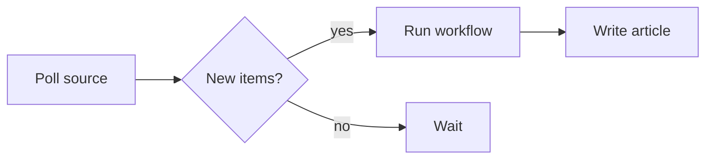

# Kiri — Workflow Authoring Reference

Drop this file into a kiri workspace (or copy it into the workspace's `CLAUDE.md`) so an AI assistant has full context on how to write workflows, bundles, prompts, and `articles:` / `summarize:` blocks — and how to shape agentic sessions with `kiri.md` and personas — without hunting around for the schema.

Kiri is a **local-first, git-based workflow orchestrator**. A workflow is a linear pipeline of steps: the previous step's stdout becomes the next step's stdin, and any step that declares an `id` can have its output referenced by name from later steps, articles, and the summariser. Workflows are YAML, bundles are bash scripts on disk, prompts are plain text templates.

> **One rule that bites people early:** kiri runs steps with a **scoped env**. Nothing from the parent shell is inherited. If a step needs `MY_TOKEN`, set it explicitly under that step's `env:`. The exceptions are `PATH`, `HOME`, `USER`, `LOGNAME`, and the `KIRI_*` vars kiri injects.

> **A second one:** steps execute **directly on the machine that runs kiri** — never a container or Linux CI image — so write `sh:` scripts for that OS (check `uname -s` if unsure). On macOS the userland is BSD, not GNU: `sed -i` needs a suffix argument (`sed -i ''`), `date` has no `-d` (use `-v` / `-j -f`), `grep` has no `-P`, and `timeout`/`tac`/`nproc` don't exist. And since steps run via `sh -c`, write POSIX sh, not bash — no arrays, no `[[ ]]`, no `set -o pipefail`.

---

## Workspace layout

```
<repo-root>/
  workflows/                  # YAML workflow definitions (in git)
    my-workflow.yaml
  bundles/                    # script bundles (in git)
    claude-code/
      run.sh
      README.md
    <your-bundle>/
      run.sh                  # required, executable
      README.md               # documents the env-var contract
  prompts/                    # convention only; any path under repo works
    my-prompt.tpl
  kiri.yaml                   # optional — structured config: LLM providers + MCP servers (in git; secrets are { env: } refs)
  .kiri/                      # gitignored — runtime state
    state.db                  # SQLite (Drizzle-managed)
    runs/<run-id>/            # per-run scratch dir (auto-cleaned after run)
    workflow.schema.json      # JSON Schema for editor LSP
    kiri.schema.json          # JSON Schema for kiri.yaml
    mcp-credentials.json      # OAuth tokens for MCP servers (mode 0600)
    tool-permissions.json     # per-tool allow/ask/off for sessions
```

`workflows/` is scanned top-level only — nested YAML files are ignored by design. The scan runs at startup and re-runs on file change (hot reload, always on — `kiri.yaml` reloads the same way).

---

## Workflow YAML — full schema

```yaml
# yaml-language-server: $schema=../.kiri/workflow.schema.json   # editor LSP

name: My Workflow            # required, unique across workflows/
description: "..."           # optional — one-line summary, shown as the workflow page deck
group: Dev                   # optional — grouping label; buckets the workflow in the catalog + shows as the workflow page eyebrow

inputs:                      # optional — parameters collected via a modal at invoke
  - name: pr_number          # identifier referenced from a step's env (`{ input: pr_number }`)
    description: "..."       # optional, shown as help text next to the field
    required: true           # optional; required inputs gate the modal's submit
  - name: branch
    default: main            # optional, pre-fills the modal field

steps:                       # required, ≥1
  - use: <bundle-name>       # references bundles/<bundle-name>/run.sh
    id: fetch                # optional — names this step so later steps can reference its stdout
    name: "Fetch the PR"     # optional — short label shown as the step title in the Schema tab + run timeline
    description: "..."       # optional, longer detail surfaced when the step is expanded
    env:                     # optional, flat key→value map (see "env: rules")
      KEY: "value"
      PR_NUMBER:
        input: pr_number     # resolved at spawn from the run's `inputs` snapshot

  - sh: |                    # OR inline shell — sugar for one-shots
      set -eu
      echo "anything"
    name: "Post-process"     # optional — defaults to the script's first line when omitted
    env:
      RAW_PR:
        step: fetch          # resolved at spawn to the `fetch` step's stdout

  - llm:                     # OR a first-party model completion (no bundle) — see "First-party LLM steps"
      model: anthropic:claude-haiku-4-5     # provider:model; provider names a kiri.yaml entry
      prompt: "Summarise {{KIRI_INPUT}}."   # inline OR prompt_file: prompts/x.tpl (exactly one)
    name: "Summarise"        # optional — defaults to the model id when omitted

articles:                    # optional — long-form markdown articles, produced after all steps complete ok
  - slug: digest             # required, kebab-case-only ([a-z0-9-]+), unique within workflow — the article's URL id
    name: "Friendly Title"   # optional series label — feed chip + page eyebrow (defaults to a humanised slug)
    description: "..."       # optional
    use: claude-code         # OR sh: |  …  OR llm: { … }  — same shape as a step
    env:
      PROMPT_FILE: prompts/digest.tpl
      DATA:
        step: fetch          # articles get no stdin — data arrives through env refs

summarize:                   # optional — one-shot post-run summary
  llm:
    model: anthropic:claude-haiku-4-5   # zero-config: built-in prompt over the {{KIRI_SUMMARY_CONTEXT}} digest
```

### Top-level metadata (`description`, `group`)

Both optional, both pure presentation — neither affects execution.

- `description` — a one-line summary. Renders as the deck beneath the workflow's title on its page.
- `group` — a grouping label (e.g. `Dev`, `Ops`). Buckets the workflow under that label in the workflow catalog (groups sorted alphabetically; ungrouped workflows list flat above the groups). It also shows as the eyebrow above the workflow's title on its page, so related workflows read as a set.

### Step shape rules

A step is **exactly one** of:

- `{ use: <bundle>, id?, name?, description?, env? }` — resolves to `bundles/<bundle>/run.sh`. Missing bundle → workflow fails to load with a clear error.
- `{ sh: <string>, id?, name?, description?, env? }` — inline shell, run via `sh -c`. Use YAML's `|` block scalar for multi-line.
- `{ llm: { model, prompt? | prompt_file? }, id?, name?, description?, env? }` — a first-party model completion, no bundle. See *First-party LLM steps* below.

`id?`, `name?`, and `description?` are optional and apply to any shape:

- `id` — names the step so later steps, articles, and the summariser can reference its stdout via `{ step: <id> }` env refs. Must match `^[a-z][a-z0-9_-]*$` and be unique within the workflow. `summarize:` cannot declare one — nothing runs after it to reference its output.
- `name` — a short, human-readable label, shown as the step's title in the Schema tab and the run timeline. Defaults to the bundle reference (`use:`), the script's first non-empty line (`sh:`), or the model id (`llm:`). Set it so multi-line scripts read as a label, not a code fragment.
- `description` — longer detail, surfaced when the step's row is expanded.

`sh:`/`use:` steps (not `llm:`, not `summarize:`) may also declare `outputs: [<name>, ...]` — named values the step promises to emit with `kiri-output <name> <value>` (a helper kiri puts on the step's PATH). Names match the id grammar, are unique within the step, and require an `id`. A step that exits ok without emitting every declared name **fails**; consumers pull one value with `{ step: <id>, output: <name> }` instead of re-parsing stdout.

Mixing `use:`, `sh:`, and `llm:` on the same step is a schema error.

### `env:` rules

- Flat `key → value` map. Each value is **either** a literal string **or** a structured reference:
  - `{ input: <name> }` — a declared workflow input's value.
  - `{ step: <id> }` — an earlier step's stdout, **byte-for-byte** (never trimmed or truncated).
  - `{ step: <id>, output: <name> }` — one named value the step emitted via `kiri-output`; the target step must declare the name in its `outputs:`.
  - `{ article: <slug> }` — an already-produced article's markdown. Only valid on `articles:` entries (earlier siblings only, by list order) and `summarize:` — a main step can't reference articles, they don't exist yet.
- **The reference graph is validated at load time.** Unknown input names, step ids, article slugs, and undeclared output names fail the workflow, as do self- and forward-references — refs are backward-only. At run time the fail-fast lifecycle guarantees every ref target completed `ok` before its consumer spawns.
- **String values must be strings.** Numbers/booleans must be quoted: `MAX_TURNS: "50"`, not `MAX_TURNS: 50`.
- Keys starting with `KIRI_` are **rejected at load time**. That namespace is reserved.
- User env is applied **first**, then `PATH`, `HOME`, `USER`, `LOGNAME` from the kiri parent process, then `KIRI_*` overlays. A workflow can't shadow `PATH` or `KIRI_RUN_ID`.
- **Size guard:** a ref-resolved value that pushes a spawned step's env past ~900 KB (headroom under the OS ~1 MB ARG_MAX) fails the step with an error naming the largest entries. `llm:` steps resolve refs in-process and are exempt.

### `inputs:` rules

- Optional. Declares **named parameters collected via a modal** at invoke time. A workflow with no `inputs:` runs immediately on click; one with `inputs:` opens the modal first.
- Each entry is `{ name, description?, required?, default?, options? }`. **Values are strings** — env vars are strings anyway.
- `name` must match `^[a-z_][a-z0-9_]*$` and is unique within the workflow.
- `required: true` gates the modal's submit until the field is non-empty. `default` pre-fills the field at open.
- `options: [...]` constrains the input to a fixed list of allowed strings. The modal renders a picker (not a text field), the declared `default` (if any) must be one of the entries — failures are caught at load time — and values supplied at invoke are rejected if they aren't in the list. Useful for "pick one of these environments / models / regions" inputs.
- Wire an input into a step / articles / summarise `env:` with `{ input: <name> }`. No string interpolation, no templating — keep the YAML pure data.
- The resolved input map is snapshotted onto the run's row, so the feed shows what a run was invoked with and a re-run can pre-fill from the same snapshot.

### `articles:` rules

- Each entry is `use:`, `sh:`, or `llm:` (same shapes as a step) plus a `slug`. Entries run **after every step completes `ok`** — a failed or cancelled pipeline skips them entirely. One after another, serially, in declared order.
- Entries get **empty stdin and no auto-injected data**. They take exactly the data they declare through `{ step: <id> }` / `{ article: <slug> }` env refs.
- Each entry's **trimmed stdout** is stored as a markdown article, keyed by `slug`. It appears as a chip on the feed and in the run detail page's Articles phase, with its own `/runs/:id/articles/:slug` page rendered through a sandboxed markdown parser.
- **The run is fail-fast.** A failing article entry marks the run `failed` and halts the remaining entries and the summariser — the same way a failing step halts the pipeline. Cancel mid-article flips the run to `cancelled` and halts.
- **Structure the body as a document with one headline and `##` sections.** Open with a single `# Headline` — the article page lifts it out as the page title and drops anything before it, so don't emit chatter like "Here's the article" ahead of it. Use `##` for the sections beneath: they become the article's table of contents. Sub-divide with `###` and deeper as usual.
- The entry's `name` is the article's **series label**, shown as a feed chip and the page eyebrow — and used as the page title only when the body carries no `# Headline`. Let the body bring its own headline (this edition's subject) and let `name` name the recurring series (e.g. `Daily Briefing`).
- `slug` must match `^[a-z0-9-]+$` and be unique within the workflow.

### `summarize:` rules

- A single `use:`, `sh:`, or `llm:` step, run **last** — after `steps:` and `articles:` — and **only when the run is still `ok`**. A failed step or article entry skips it.
- Every summarize step is injected **`KIRI_SUMMARY_CONTEXT`** — a prompt-ready plain-text digest of the run; see *The summary digest* below. A `sh:`/`use:` summariser reads `$KIRI_SUMMARY_CONTEXT`; an `llm:` prompt templates `{{KIRI_SUMMARY_CONTEXT}}`.
- `summarize: { llm: { model } }` with no prompt is **zero-config** — kiri supplies a built-in summary prompt over the digest.
- Its trimmed stdout becomes the run's `summary` (rendered on the activity feed row and at the top of the run detail page). Empty stdout leaves `summary` null.
- Failure is **non-fatal** — the summariser is best-effort; the run's terminal status is unaffected. (Cancel mid-summarise still flips the run to `cancelled`.)
- It cannot declare an `id` — nothing runs after it.

### Recommendations — proposed follow-up workflows

A main step can recommend follow-up workflow invocations attached to its run. They surface on the run detail page under a **Recommended** section as trigger buttons; clicking one opens the standard invoke modal pre-filled with the proposed inputs. Use this when a run *enumerates* things a follow-up could act on — open PRs, failing tests, queued items — so each enumerated thing turns into a one-click launch.

- Write JSON Lines to the path in `$KIRI_RECOMMENDATIONS_FILE`, one object per line: `{ title, workflow, description?, inputs? }`. `title` and `workflow` are required; `inputs` is a flat `{ string: string }` map matching the target workflow's declared inputs.
- `KIRI_RECOMMENDATIONS_FILE` is set on **main `steps:` only** — not on `articles:` or `summarize:`. Don't read it from those phases.
- Only `ok` steps' files are ingested. A failed or cancelled step's recommendations are discarded.
- Malformed JSON or schema-failing lines are logged and skipped without affecting the step; surrounding valid lines still ingest.
- Cross-step ingestion order is preserved: a recommendation from step 0 always has a lower `index` than one from step 1.
- Don't try to look the target workflow up at emission time — the runner doesn't validate it. If the workflow disappears from your repo before the user clicks, the trigger button simply renders disabled with a "workflow not found" tooltip.

Example (a step that aggregates open PRs and recommends a per-PR review):

```yaml
name: open-prs
steps:
  - sh: |
      # gh pr list is scoped to a single repo, so resolve owner/name once.
      repo=$(gh repo view --json owner,name --jq '"\(.owner.login)/\(.name)"')
      gh pr list --json number,title,author | jq -c '.[]' | while read -r pr; do
        number=$(echo "$pr" | jq -r .number)
        title=$(echo "$pr" | jq -r .title)
        author=$(echo "$pr" | jq -r .author.login)
        jq -nc --arg n "$number" --arg t "$title" --arg a "$author" --arg r "$repo" \
          '{title: ("Review pull request " + $r + " #" + $n), description: ($t + " (by @" + $a + ")"), workflow: "pr-review", inputs: {pr_number: $n, repo: $r}}' \
          >> "$KIRI_RECOMMENDATIONS_FILE"
      done
```

Putting the action + `owner/repo` + PR number in the title and saving the PR's own title for the description keeps recommendations scannable across repos — without the repo qualifier a feed mixing runs against different repos would show indistinguishable "Review PR #5" entries.

---

## How data flows between steps

```
steps[0] stdin = ""               steps[0] stdout ─┐        id: fetch ──→ { step: fetch }
                                                   ▼
steps[1] stdin = steps[0] stdout  steps[1] stdout ─┐
                                                   ▼
steps[2] stdin = steps[1] stdout  steps[2] stdout
```

- `steps[0]` receives empty stdin. Every subsequent step receives the **previous step's full stdout** on stdin.
- A step that declares an `id` can additionally be referenced **by name**: a later step, an articles entry, or the summariser pulls its stdout with a `{ step: <id> }` env ref — byte-for-byte, no truncation. Piping suits adjacent steps; refs suit "the article needs step 0's output, not step 3's".
- `articles:` entries and `summarize:` receive **empty stdin**. Articles take data through `{ step: <id> }` / `{ article: <slug> }` env refs; the summariser additionally gets the `KIRI_SUMMARY_CONTEXT` digest.
- **The run is fail-fast end to end.** A non-zero exit (or failed completion) on any step halts the pipeline: later steps never start, and `articles:` and `summarize:` are **skipped**. A failing article entry likewise fails the run and halts the remaining entries and the summariser. Only a failing summariser is non-fatal.

---

## Environment kiri injects into every step

| Var | Value |
| --- | --- |
| `KIRI_RUN_ID` | UUID of this run. |
| `KIRI_STEP_INDEX` | 0-based index of this step within the run. Articles continue numbering after the last regular step; the summariser comes after the articles. |
| `KIRI_REPO_ROOT` | Absolute path of the workspace root (where `kiri` was launched). Resolve all relative paths (`prompts/foo.tpl`, etc.) against this. |
| `KIRI_BUNDLE_DIR` | Absolute path to the bundle's own dir (e.g. `<root>/bundles/<name>/`). **Only set for `use:` steps** — sh-steps don't have a bundle. |
| `KIRI_SUMMARY_CONTEXT` | The plain-text run digest (see *`summarize:` rules*). **Only set on the `summarize:` step.** |
| `KIRI_RECOMMENDATIONS_FILE` | Absolute path the step may write JSON Lines to, one recommendation per line: `{title, workflow, description?, inputs?}`. Lines are ingested as `recommendations` rows after the step succeeds; failed and cancelled steps' files are discarded. **Only set on main `use:` / `sh:` `steps:` — not `articles:`, `summarize:`, or `llm:` steps** (a completion can't emit recommendations). |
| `PATH`, `HOME`, `USER`, `LOGNAME` | Inherited from the kiri parent process. |

Step working directory is the **per-run scratch dir** at `.kiri/runs/<run-id>/`, not the repo root. Use `KIRI_REPO_ROOT` to reach repo files.

---

## The summary digest (`KIRI_SUMMARY_CONTEXT`)

Injected into every `summarize:` step — and only there. A prompt-ready plain-text digest of the run:

```
Workflow: Dev
Duration: 41.2s

## Step 0 — Fetch dev feeds (12.3s)

[the step's stdout]

## Step 1 — Pick the front page (8.9s)

[…]

## Article: Dev Edition (edition)

[the article's markdown]
```

- Step labels fall back `name` → `id` → the bundle ref / model id / the script's first non-empty line. Empty stdout renders `(no output)`.
- Each step's stdout and each article's markdown is independently capped at **64 KB** (marked `[truncated]`). The digest is the **gist plane** — deliberately lossy, sized to inline into a prompt. When a summariser needs an output at full fidelity, take it through a `{ step: <id> }` / `{ article: <slug> }` env ref instead: the **data plane** is never truncated.
- One channel, both shapes: a bundle/`sh:` summariser reads `$KIRI_SUMMARY_CONTEXT`; an `llm:` summariser templates `{{KIRI_SUMMARY_CONTEXT}}`. There is no file variant.
- Since summarize only runs on fully-`ok` runs, the digest carries no failure narration — a failed run's diagnostics live on the run detail page.

---

## Example bundles

The repo's `examples/` carries two bundles that show the common shape for an AI step — `claude-code` spawns the Claude Code CLI, `lm-studio` sends a one-shot completion to a local OpenAI-compatible server. Both use the same `{{VAR}}` templating, both are plain bash you can read and edit. They aren't created by `kiri init` (which scaffolds only a hello-world workflow); you copy them in or author your own under `bundles/<name>/` — see *Authoring a custom bundle* below.

### `claude-code` — general-purpose CC step

```yaml
- use: claude-code
  env:
    PROMPT: "Summarise {{KIRI_INPUT}} in one sentence."   # one-of PROMPT/PROMPT_FILE required
    PROMPT_FILE: prompts/my-prompt.tpl                    # one-of PROMPT/PROMPT_FILE required
    MAX_TURNS: "50"                                       # optional, default "50"
    MODEL: opus                                           # optional, claude picks default
```

- `PROMPT` wins over `PROMPT_FILE` when both are set (no concat).
- `PROMPT_FILE` is resolved against `KIRI_REPO_ROOT` if relative.
- The previous step's stdout is exposed as `{{KIRI_INPUT}}` (one trailing newline trimmed).
- Tool permissions come from `~/.claude/settings.json` — this bundle does **not** synthesise its own. Constrain via prompt wording or your global claude settings.

### Using a bundle as the summariser

Any bundle works in `summarize:` — the digest arrives as an env var like any other, so reference it from the prompt:

```yaml
summarize:
  use: claude-code
  env:
    PROMPT: |
      Summarise this workflow run in one or two sentences for an activity feed:

      {{KIRI_SUMMARY_CONTEXT}}
    MODEL: haiku
```

(For a plain summary with no agentic work, the zero-config `summarize: { llm: { model } }` is simpler — see *First-party LLM steps*.)

### Prompt templating (both bundles)

`{{VAR}}` placeholders are substituted from the environment in a single left-to-right pass:

- Names: `[A-Z_][A-Z0-9_]*`.
- Unknown vars resolve to empty.
- Substituted values are **not** re-scanned — a value containing `{{X}}` stays literal.
- Available vars: `{{KIRI_INPUT}}`, the `KIRI_*` vars from the table above (`{{KIRI_SUMMARY_CONTEXT}}` in `summarize:`, `{{KIRI_RECOMMENDATIONS_FILE}}` on main steps), plus anything in the step's own `env:` block — including `{ step: <id> }` / `{ article: <slug> }` refs, which arrive as ordinary env vars under the names you gave them.

Example template:

```
# prompts/greet.tpl
Say a {{TONE}} one-sentence hello to {{KIRI_INPUT}}.
```

```yaml
- sh: echo "Lee"
- use: claude-code
  env:
    PROMPT_FILE: prompts/greet.tpl
    TONE: cheerful
```

Renders: `Say a cheerful one-sentence hello to Lee.`

---

## First-party LLM steps (`llm:`)

When a step just needs a **model completion** — send a prompt, get text back — use an `llm:` step instead of a bundle. Kiri calls the provider's API directly, in-process; nothing is spawned. Reach for a bundle (`claude-code`, `lm-studio`) when a step needs to *do* something agentic (open files, run tools, shell out); reach for `llm:` for a plain completion.

```yaml
- llm:
    model: anthropic:claude-haiku-4-5   # provider:model — the prefix names a kiri.yaml entry
    prompt: |                           # inline prompt …
      Summarise the following in three bullets.

      {{KIRI_INPUT}}
  name: "Summarise"                      # optional, same id/name/description/env as any step
- llm:
    model: local:llama-3.1-8b
    prompt_file: prompts/review.tpl      # … OR a prompt file (exactly one of prompt / prompt_file)
```

- **`model` is `provider:model`.** The prefix must name an entry under `providers:` in `kiri.yaml` (below); the rest is the provider's model id. A bare `model: claude-haiku` with no provider prefix is a load-time error.
- **Exactly one of `prompt` / `prompt_file`** on a `steps:` / `articles:` entry. `prompt_file` resolves against the workspace root. (A `summarize:` step may omit both — see zero-config below.)
- **Templating is the same `{{VAR}}` pass the bundles use.** `{{KIRI_INPUT}}` carries the previous step's stdout into a pipeline step's prompt (one trailing newline trimmed); the step's own `env:` vars — including `{ step: }` / `{ article: }` refs — are available under their names; unknown vars resolve empty.
- **The completion text is the step's stdout** — it flows downstream / becomes the article / becomes the summary, exactly like a bundle's stdout. Token counts land on the envelope's `traces.usage` and show in the run timeline.
- **No file channels.** A completion can't open files, so an `llm:` step gets **no `KIRI_RECOMMENDATIONS_FILE`** (it can't emit recommendations — use an `sh:` or bundle step for that). Upstream data reaches an `llm:` articles entry through `{ step: <id> }` / `{ article: <slug> }` env refs rendered into the prompt by name (`{{DRAFT}}`), and an `llm:` summariser additionally gets `{{KIRI_SUMMARY_CONTEXT}}`.

### Zero-config summariser

A `summarize:` step can be just a model:

```yaml
summarize:
  llm:
    model: anthropic:claude-haiku-4-5   # no prompt — kiri supplies a built-in summary prompt
```

With no `prompt` / `prompt_file`, kiri uses a baked-in feed-summary prompt over the injected `{{KIRI_SUMMARY_CONTEXT}}` digest.

### Providers in `kiri.yaml`

Providers live under `providers:` in the workspace-root `kiri.yaml` (kept in git) — kiri's structured config file. Each `llm:` step's `provider:` prefix names an entry here. (The same file's `mcp:` block declares MCP servers for agentic sessions — see *Agentic sessions* below.)

```yaml
# kiri.yaml
# yaml-language-server: $schema=.kiri/kiri.schema.json

providers:
  anthropic:                  # entry name = the `provider:` prefix in a model id
    type: anthropic           # anthropic | openai | openai-compatible
    api_key:
      env: ANTHROPIC_API_KEY  # API keys are ALWAYS { env: <NAME> } refs — never a literal
  local:
    type: openai-compatible
    base_url: http://localhost:1234/v1   # required for openai-compatible (LM Studio, Ollama, vLLM)
```

- **`type`** is one of `anthropic`, `openai`, `openai-compatible`. `base_url` is optional for the first two (override the default endpoint) and **required** for `openai-compatible`.
- **`api_key` is only ever `{ env: <NAME> }`** — a reference to the environment variable holding the key. A literal key string is rejected so secrets stay out of git; the key is read at run time, and a missing env var fails the step cleanly.
- The `providers:` map is **optional** — a workspace with no `llm:` steps needs none. A worked example lives in `examples/kiri.yaml`.
- **File name:** `kiri.yaml` is canonical; `kiri.yml` works too. If both exist, `kiri.yaml` wins (kiri warns).

---

## Authoring a custom bundle

Add a folder under `bundles/<name>/` with `run.sh` + a `README.md` documenting its env-var contract:

```
bundles/my-bundle/
  run.sh
  README.md
```

`run.sh` is plain POSIX shell (bash is fine — must be executable). It receives the previous step's stdout on stdin and writes its result on stdout. Use stderr for diagnostics; stdout is the next step's input.

```sh
#!/bin/sh
set -eu

# Required from kiri
: "${KIRI_REPO_ROOT:?required (kiri injects this)}"
: "${KIRI_RUN_ID:?required (kiri injects this)}"

# Required from the workflow's env: block
: "${TARGET:?TARGET env var is required}"

# Read previous step's output (empty for first step)
input="$(cat)"

# Do the thing; stdout goes to the next step / article / summary
printf 'processed %s for %s\n' "$TARGET" "$input"
```

**Rules:**

- Exit `0` on success; non-zero on failure. The exit code is what kiri reads.
- Don't `cd` away from the scratch dir unless you mean to — kiri restores nothing.
- Anything you read from disk should be resolved against `$KIRI_REPO_ROOT`, not relative cwd.
- Document the env-var contract in `README.md` next to `run.sh`.
- Adding a fork? `cp -r bundles/claude-code bundles/my-bundle && $EDITOR bundles/my-bundle/run.sh`.

---

## Invoking a workflow

- **Manual** — click *Run* in the UI on `https://local.kiri.build` (or `http://localhost:4242`). Workflows with `inputs:` open a modal first (one field per declared input, defaults pre-filled, required inputs gate submit); workflows without `inputs:` invoke on a single click.
- **Re-run** — an existing run can be re-triggered in place from its run detail page. The previous attempt's steps, articles, and summary are cleared.

There is no cron, file watch, webhook, or inbox polling. For polling shapes, write a workflow whose first step does the poll and run it when you want it.

---

## Execution semantics

- Runs are independent — invoking several workflows (or the same one twice) runs them concurrently; there is no global queue.
- **Fail-fast:** a failing step halts the pipeline — later steps never start, `articles:` and `summarize:` are skipped, the run is marked `failed`. A failing article entry fails the run and halts the remaining entries and the summariser. Only a failing summariser leaves the run's status untouched.
- Cancel from the UI sends `SIGTERM` then `SIGKILL` to the active child (an in-flight `llm:` call is aborted). A cancelled run skips everything that hasn't started.
- The per-run scratch dir at `.kiri/runs/<run-id>/` is removed when the run ends.

---

## The standard step envelope

Every step (regular, articles entry, summarize) produces:

```ts
{
  status: "ok" | "failed",
  output: string,           // captured stdout
  error?: { message, stack? },
  traces: {
    stdout, stderr, durationMs,
    usage?: { inputTokens?, outputTokens?, totalTokens? }   // llm: steps only
  }
}
```

`status: "failed"` corresponds to a non-zero exit code (or a failed completion). `stdout` is what flows downstream; `stderr` is captured for the run page but not piped onward. For an `llm:` step `stdout` is the completion text, `stderr` is empty, and `traces.usage` carries the call's token counts when the provider reports them (shown in the run timeline).

---

## Worked examples

### 1. Single-step shell workflow with a zero-config summary

```yaml
# workflows/pr-review-queue.yaml
name: PR Review Queue
steps:
  - sh: |
      set -eu
      prs=$(gh search prs --review-requested=@me --state=open)
      if [ -z "$prs" ]; then
        echo "No PRs awaiting your review."
      else
        echo "$prs"
      fi
summarize:
  llm:
    model: anthropic:claude-haiku-4-5
```

### 2. Shell → article via a `{ step: <id> }` ref

```yaml
# workflows/hackernews-digest.yaml
name: HackerNews Digest
steps:
  - sh: |
      set -eu
      limit=10
      ids=$(curl -fsSL "https://hacker-news.firebaseio.com/v0/topstories.json" \
        | jq -r ".[:${limit}][]")
      printf '['
      first=1
      for id in $ids; do
        [ "$first" = 1 ] && first=0 || printf ','
        curl -fsSL "https://hacker-news.firebaseio.com/v0/item/${id}.json"
      done
      printf ']'
    id: fetch
    name: Fetch top stories
articles:
  - slug: digest
    name: HackerNews Top Stories
    use: claude-code
    env:
      PROMPT_FILE: prompts/hackernews-digest.tpl
      MODEL: sonnet
      STORIES:
        step: fetch          # the fetch step's stdout, rendered as {{STORIES}} in the prompt
summarize:
  llm:
    model: anthropic:claude-haiku-4-5
```

The prompt template reads `{{STORIES}}` (the JSON array of HN items) and formats markdown. The entry's stdout becomes the article.

### 3. AI step consuming the previous step's stdout via `{{KIRI_INPUT}}`

```yaml
name: Idea Polisher
steps:
  - sh: echo "kiri makes personal automation calm"
  - use: claude-code
    env:
      PROMPT: |
        Rewrite this idea as a one-sentence tagline:

        {{KIRI_INPUT}}
      MAX_TURNS: "1"
```

### 4. Parameterised workflow with `inputs:`

```yaml
# workflows/pr-review.yaml
name: PR Review
group: Dev                   # clusters under "Dev" in the catalog
inputs:
  - name: pr_number
    description: GitHub PR to review (number, not URL)
    required: true
  - name: owner
    default: LeeCheneler
  - name: model
    description: Claude model to use for the review
    options: [haiku, sonnet, opus]
    default: sonnet
steps:
  - sh: gh pr view "$PR_NUMBER" --repo "$OWNER/kiri" --json title,body,files
    env:
      PR_NUMBER:
        input: pr_number
      OWNER:
        input: owner
  - use: claude-code
    env:
      PROMPT_FILE: prompts/pr-review.tpl
      MODEL:
        input: model
```

Clicking *Run* on this workflow opens a modal with three fields: `pr_number` (required text, blank), `owner` (text, pre-filled with the default), and `model` (picker constrained to `haiku | sonnet | opus`, pre-selected on `sonnet`). The runner snapshots the submitted values onto the run's row before spawning step 0, where the `{ input: <name> }` refs in `env:` resolve to the snapshotted values.

### 5. Multiple articles, one building on another via `{ article: <slug> }`

```yaml
name: Daily Briefing
steps:
  - sh: |
      set -eu
      # fetch some upstream data, print JSON to stdout
      curl -fsSL https://example.com/api/today
    id: fetch
articles:
  - slug: full
    name: Full report
    use: claude-code
    env:
      PROMPT: "Write a long-form markdown report from this JSON: {{DATA}}"
      DATA:
        step: fetch
      MAX_TURNS: "12"
  - slug: summary
    name: Today, summarised
    use: claude-code
    env:
      PROMPT: "Condense this report into a 5-bullet markdown summary:\n\n{{REPORT}}"
      REPORT:
        article: full        # earlier siblings only — `full` must be declared before `summary`
summarize:
  llm:
    model: anthropic:claude-haiku-4-5
```

### 6. Custom bundle with a typed env contract

```
bundles/post-to-slack/
  run.sh
  README.md
```

```sh
#!/bin/sh
# run.sh
set -eu

: "${SLACK_WEBHOOK_URL:?required}"
: "${CHANNEL:=#general}"

body="$(cat)"
curl -fsSL -X POST -H 'Content-Type: application/json' \
  --data "$(jq -nc --arg t "$body" --arg c "$CHANNEL" '{channel:$c,text:$t}')" \
  "$SLACK_WEBHOOK_URL"
```

```yaml
# workflows/notify.yaml
name: Notify
steps:
  - sh: echo "deploy finished"
  - use: post-to-slack
    env:
      SLACK_WEBHOOK_URL: "https://hooks.slack.com/services/…"   # secret — see below
      CHANNEL: "#ops"
```

**Secrets** don't have a first-class store. API keys in `kiri.yaml` are `{ env: }` refs; for anything else, pull it from a mode-600 file inside the `sh:` step (or inside a bundle's `run.sh`) — keep secrets out of YAML and out of git.

### 7. First-party `llm:` pipeline — completion, article, and zero-config summary

```yaml
# kiri.yaml (workspace root)
providers:
  anthropic:
    type: anthropic
    api_key:
      env: ANTHROPIC_API_KEY
```

```yaml
# workflows/release-notes.yaml
name: Release Notes
steps:
  - sh: |
      cat <<'CHANGES'
      - add first-party llm: workflow steps
      - render llm token usage in the run timeline
      CHANGES
    name: Collect changes
  - llm:
      model: anthropic:claude-haiku-4-5
      prompt: |
        Rewrite these changelog lines as friendly release notes.

        {{KIRI_INPUT}}
    id: draft
    name: Draft the notes
articles:
  - slug: release-notes
    name: Release Notes
    llm:
      model: anthropic:claude-haiku-4-5
      prompt_file: prompts/release-notes.tpl   # reads {{DRAFT}}
    env:
      DRAFT:
        step: draft
summarize:
  llm:
    model: anthropic:claude-haiku-4-5          # zero-config — built-in summary prompt
```

The pipeline `llm:` step reads the previous step's stdout via `{{KIRI_INPUT}}`. The `llm:` articles entry gets empty stdin, so it declares the data it needs — the `draft` step's stdout — as a `DRAFT` env ref and its prompt file reads `{{DRAFT}}`. The full version lives at `examples/workflows/release-notes.yaml`.

---

## Charts in articles

The markdown an `articles:` entry emits can embed charts. Fence a block as
`chart` and put a [Vega-Lite](https://vega.github.io/vega-lite/) JSON spec
in the body; kiri renders it inline through the same sandboxed renderer as
the rest of the article. One spec format covers every chart type — bar,
line, area, scatter, arc (pie/donut), heatmap, and more.

````markdown
```chart
{
  "width": "container",
  "height": 200,
  "data": {
    "values": [
      { "day": "Mon", "runs": 12 },
      { "day": "Tue", "runs": 19 },
      { "day": "Wed", "runs": 8 }
    ]
  },
  "mark": "bar",
  "encoding": {
    "x": { "field": "day", "type": "nominal" },
    "y": { "field": "runs", "type": "quantitative" }
  }
}
```
````

- **Data is inline only.** Put the numbers in `data.values`. A spec that
  fetches remote data (`data: { url: ... }`) is rejected and degrades to a
  notice — an articles entry should compute its data and write it into the
  spec.
- **Theming is automatic.** Background, fonts, axis/legend colours, and the
  palette come from the site theme. Don't hand-set `config` or colours
  unless an encoding genuinely needs a specific one.
- **`"width": "container"`** makes a chart fill the article column; pair it
  with an explicit `"height"`.
- **Bad specs degrade, they don't crash.** Invalid JSON, or a spec
  Vega-Lite rejects, renders an inline error notice; the surrounding
  article is unaffected.

---

## Mermaid diagrams in articles

For relationships rather than numbers — flowcharts, sequence diagrams,
state machines, ER diagrams — fence a block as `mermaid` and write
[mermaid](https://mermaid.js.org/) syntax in the body. kiri renders it
inline through the same sandboxed surface as the rest of the article.

````markdown

````

- **The reader gets a diagram first, source on demand.** The rendered
  diagram leads, with a tab to read the raw mermaid text (and copy it) and
  an action to enlarge the diagram in a full-width modal.
- **Theming is automatic.** Colours and fonts come from the site theme;
  don't set a mermaid `theme` or hand-pick colours.
- **Bad diagrams degrade, they don't crash.** Source mermaid can't parse
  renders an inline error notice; the surrounding article is unaffected.
- **Reach for a chart for quantities, a diagram for structure.** Use a
  `chart` block when the point is the numbers; a `mermaid` block when the
  point is how things connect.

---

## Trust model & guardrails

- Bundles and `sh:` steps run with **your user's permissions**. There's no sandbox. Read scripts before you run them, same as you'd read any shell script.
- HTTP API binds to `127.0.0.1` only and requires an `X-Kiri-Client` header on state-changing endpoints — guards against cross-origin attacks from other browser tabs.
- Workflow inputs from external sources (PR titles, issue bodies, HN items) are **untrusted**. Don't splice them into shell command strings — pass through env vars or stdin. The orchestrator does this for you; preserve it in your bundles.
- AI output is **untrusted data** when it flows to a downstream step. If an AI step's stdout becomes input to a shell step, treat it like any other external string.

---

## Common authoring mistakes

| Mistake | Fix |
| --- | --- |
| `MAX_TURNS: 50` (yaml number) | `MAX_TURNS: "50"` — `env:` values must be strings. |
| `env: { KIRI_MODE: "x" }` | Don't prefix keys with `KIRI_`. Reserved. |
| Relative path `prompts/foo.tpl` from inside a step expecting cwd-relative | Resolve against `$KIRI_REPO_ROOT`. The step's cwd is the scratch dir, not the repo root. |
| Reading the parent shell's `MY_TOKEN` | Won't work. Set it explicitly under the step's `env:` (or pull it from a mode-600 file inside the script). |
| An articles entry that expects the previous step's stdout on stdin | Articles get empty stdin. Declare the data through a `{ step: <id> }` / `{ article: <slug> }` env ref instead. |
| Referencing a step that declared no `id` | Only steps with an `id:` are referenceable. Add one to the step you need. |
| `{ step: <id> }` pointing at the same or a later step | Refs are backward-only — a load-time error. |
| `{ article: <slug> }` on a main step | Article refs are only valid on `articles:` entries (earlier siblings) and `summarize:`. |
| Two `articles:` entries with the same `slug` | Slugs must be unique within a workflow. |
| Expecting articles/summarise to run after a failed step | The run is fail-fast: a failed step (or article entry) skips everything after it. |
| `llm: { model: claude-haiku }` (no provider prefix) | Use `provider:model`, e.g. `anthropic:claude-haiku-4-5`. The prefix must name a `kiri.yaml` provider entry. |
| `api_key: sk-...` literal in `kiri.yaml` | Use `api_key: { env: ANTHROPIC_API_KEY }`. Literal keys are rejected so secrets stay out of git. |
| `llm:` step that writes to `$KIRI_RECOMMENDATIONS_FILE` | Not set for `llm:` steps — a completion can't emit recommendations. Use an `sh:` or bundle step. |
| Multi-line `sh:` without `set -eu` | `sh -c` doesn't stop on first failure by default. Start every non-trivial `sh:` with `set -eu`. |
| A `chart` block whose spec fetches remote data (`data: { url }`) | Inline the data under `data.values`. Remote-data specs are rejected and degrade to a notice. |

---

## Editor LSP

The JSON Schemas under `.kiri/` are generated from the Zod schemas and refreshed on every `kiri` launch. Pin the matching one at the top of each YAML file for in-editor validation:

```yaml
# workflows/*.yaml
# yaml-language-server: $schema=../.kiri/workflow.schema.json
```

```yaml
# kiri.yaml (workspace root)
# yaml-language-server: $schema=.kiri/kiri.schema.json
```

---

## Agentic sessions: `kiri.md` & personas

Sessions are kiri's second pillar — a multi-turn chat with a model, separate from workflows. You don't author a session the way you author a workflow; instead two optional workspace files shape every session's **system prompt**, which kiri composes fresh on each turn from three layers, in order:

**core (kiri) → `kiri.md` → persona**

- **`kiri.md`** — a single markdown file at the workspace root, applied to *every* session. Its body is your standing instructions: the session equivalent of a global "how I want you to behave." Optional — with no `kiri.md`, sessions run on kiri's core layer alone. Only kiri sessions read `kiri.md` — it's separate from any `CLAUDE.md`/`AGENTS.md` you keep for AI tools that edit the workspace, so that authoring guidance stays out of your sessions.
- **`personas/<name>.md`** — optional role overlays. Each file is one persona; the filename minus `.md` is its name. A persona is **attached per session** from the chat's right-hand aside (a combobox under the model picker) and is injected *after* `kiri.md`. Use one to put a session into a specific role — a code reviewer, a release-notes writer, a particular voice.

Authoring notes:

- Both are **plain markdown — no frontmatter, no schema.** The whole file body is the instruction text. Just write prose.
- The **kiri core layer is not user-editable.** It already tells the model the environment it runs in, that replies render as GitHub-flavoured markdown, and how to draw inline charts (fence a code block as `chart` with a Vega-Lite spec) and mermaid diagrams (fence a block as `mermaid`) — the same renderer as workflow articles; see *Charts in articles* and *Mermaid diagrams in articles*. Build on top of it rather than repeating it.
- Every layer is **read fresh from disk each turn**, so an edit takes effect on the next turn — git is the source of truth, nothing is snapshotted.
- The persona is **swappable mid-conversation** from the aside (applies from the next turn), alongside the model. There is no persona at creation: a session starts with none, and you attach one when you want it. The leading **None** option detaches.
- Persona names come from filenames — keep them tidy and kebab-case (`code-reviewer.md`, `release-notes.md`).
- Sessions can **author workflows** through built-in tools (create/edit/replace whole YAML files, validated before every write). When authoring an `llm:` step a session won't invent a `provider:model` — it follows `kiri.md`, copies an existing workflow, or asks. **Recommended:** name your preferred models in `kiri.md` (e.g. "for workflow llm steps, prefer `anthropic:claude-haiku-4-5`") so sessions pick them automatically.

Example `personas/code-reviewer.md`:

```
You are a meticulous senior code reviewer. Read diffs closely, flag correctness
bugs first, then design and clarity. Cite file:line. Be direct; skip the praise.
```

### Session tools — MCP servers (`mcp:` in `kiri.yaml`)

Sessions get their tools from **MCP servers** declared under `mcp:` in `kiri.yaml`, keyed by name. This is a sessions-only concept — workflows never see MCP tools (a workflow step that needs a capability scripts it or uses a bundle).

```yaml
mcp:
  tavily:                     # remote server, OAuth browser sign-in managed by kiri
    type: http
    url: https://mcp.tavily.com/mcp/
    auth: oauth
  github:                     # remote server, static header from an env ref
    type: http
    url: https://api.githubcopilot.com/mcp/
    headers:
      Authorization:
        env: GITHUB_MCP_AUTH_HEADER
  files:                      # local subprocess kiri spawns, spoken to over stdio
    type: stdio
    command: npx
    args: ["-y", "@modelcontextprotocol/server-filesystem", "/tmp"]
```

- An entry is **`stdio`** (`command`, `args?`, `env?` — kiri spawns the subprocess) or **`http`** (`url`, `headers?`, `auth: oauth?` — Streamable HTTP). Header and env values are `{ env: <NAME> }` refs, never literals. `auth: oauth` has kiri run a browser sign-in and keep the tokens in `.kiri/mcp-credentials.json` (mode 0600).
- Tools are offered to the model namespaced **`<server>__<tool>`**. Each carries a standing permission — `allow`, `ask` (the default for MCP tools), or `off` — persisted in `.kiri/tool-permissions.json` and managed from the **Tools & MCP page** (`/mcp`). An `ask` tool pauses the turn with an Allow / Always allow / Deny prompt before it runs; an `off` tool is never offered to the model. Kiri's built-in session tools ride the same controls with their own defaults (the article tools and workflow reads `allow`; the run tools — `run_workflow`, `rerun_workflow` — and the workflow write tools `ask`).
- A server whose env ref is unset, that fails to connect, or that awaits OAuth sign-in is simply absent from the session's toolset; the reason surfaces as a config-health check (an unsigned-in OAuth server shows a one-click **Connect** prompt).
- Each tool call's result is capped (truncated past ~128 KB) and time-boxed, so a huge payload or hung server degrades to a tool error the model can recover from.
- A `stdio` server is an arbitrary subprocess — treat configuring one with the same care as running any script.

A worked `mcp:` block also lives in `examples/kiri.yaml`.

---

## Where to look in the codebase

If kiri's repo is the workspace and behaviour is unclear, these are the source-of-truth files:

- **Schema (steps, articles, refs, inputs):** `src/server/workflows/schema.ts`
- **Loader (file scan, bundle resolution, error reporting):** `src/server/workflows/loader.ts`
- **Run lifecycle (steps → articles → summarize, refs, fail-fast, cancel):** `src/server/runner/run-workflow.ts`
- **Step execution (spawn, envelope, env scoping, size guard):** `src/server/runner/run-step.ts`
- **LLM step execution (prompt render, completion, usage):** `src/server/runner/run-llm-step.ts`
- **Summary digest (`KIRI_SUMMARY_CONTEXT` shape and caps):** `src/server/llm/build-summary-context.ts`
- **LLM providers (schema, loader, provider clients):** `src/server/llm/`
- **`kiri.yaml` config (providers + MCP; schema, loader, health):** `src/server/config/`
- **MCP servers (connect, tool namespacing, OAuth):** `src/server/mcp/`
- **Session system prompt (core layer, `kiri.md`, personas):** `src/server/sessions/system-prompt.ts`
- **Architecture & roadmap:** `docs/design-notes.md`
