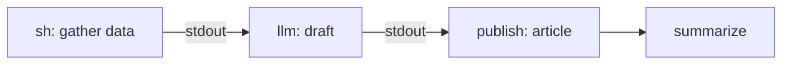

# Overview

Kiri is a local-first, git-based workbench for personal automation. You write
definitions as plain files in your own repository, run `kiri` in that directory,
and drive everything from a feed-first interface served on your own machine.
Nothing runs in the cloud and nothing runs while the app is closed — kiri is a
tool you open, work in, and close.

## Two ways to work

Kiri has two pillars that share one activity feed.

- **Workflows** — versioned YAML pipelines. Chain shell commands, reusable
  script bundles, and first-party model completions; pipe each step's output
  into the next; publish the result as a long-form article. Reach for a
  workflow when you know the shape of the work.
- **Agentic sessions** — open-ended, multi-turn chat with a model, your
  workspace context, and first-party tools. Reach for a session when you don't
  yet know the shape of the work.

Both surface in a single timeline, so a session and a scheduled-by-hand workflow
run sit side by side.

## How a run flows

A workflow is a list of steps. Each step's standard output is piped to the next
step's standard input; the first step gets empty input. After the steps, a run
can **publish** articles and **summarise** itself:

The article and summary land on the run's page and in the activity feed. See
[Workflows](/docs/workflows) for the full anatomy.

## What you get

- **Published articles** — markdown with inline charts (Vega-Lite) and Mermaid
  diagrams, rendered through a sandboxed parser.
- **Recommendations** — a run can propose its own follow-ups, each a one-click
  trigger that pre-fills a workflow's inputs.
- **MCP tools** — sessions call tools from MCP servers you declare in
  `kiri.yaml` (web search, and more).
- **Layered system prompts** — a `kiri.md` file and named personas shape every
  session.
- **Bring your own model** — Anthropic, OpenAI, or any OpenAI-compatible server
  (LM Studio, Ollama, vLLM).

## Local-first by design

- **Git-native.** Every workflow, persona, bundle, and config value is a file in
  your repo — diff it, commit it, review it. Git is the source of truth, and
  most files are read fresh from disk so edits take effect without a restart.
- **Your machine, your permissions.** Steps run as you, against your real repo
  and tools. There is no sandbox — see [Trust & security](/docs/trust-and-security).
- **No daemons.** Kiri does its work only while you have it open. There is no
  cron, no webhook, no background polling.

## Where to next

- New here? Start with [Getting started](/docs/getting-started).
- Building a pipeline? Read [Workflows](/docs/workflows) and
  [LLM providers](/docs/llm-providers).
- Want a chat instead? See [Agentic sessions](/docs/agentic-sessions).
- Looking for real examples? Browse the [Examples](/docs/examples).
