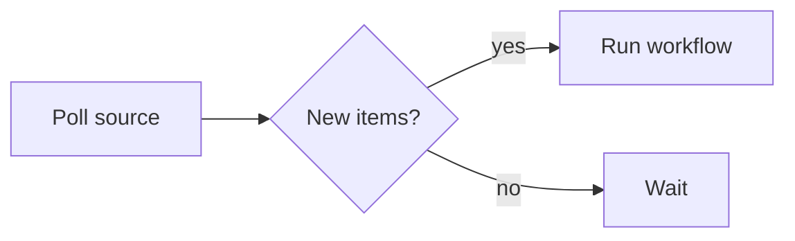

# Workflow reference

Every field of a workflow file, in one place. For the guided version, read
[Writing workflows](/docs/workflows) first.

## The file

A workflow lives at `workflows/*.yaml` and is validated on load.

| Field | Required | Description |
| --- | --- | --- |
| `name` | yes | Display name; the label on the workflow's Run button. |
| `description` | no | One-liner rendered as the deck beneath the title. |
| `group` | no | Label (e.g. `Dev`) shown as the page eyebrow to cluster related workflows. |
| `inputs` | no | Parameters collected via a modal on Run. See Inputs below. |
| `steps` | yes | The pipeline, run in order. |
| `articles` | no | Markdown documents produced after the steps. |
| `summarize` | no | Post-run step whose stdout becomes the run's summary. |

## Steps

A step is one of three shapes — `sh:`, `use:`, or `llm:` — plus optional
common fields:

| Field | Description |
| --- | --- |
| `name` | Short label in the run timeline. Falls back to the `use:` ref, the first `sh:` line, or the `llm:` model id. |
| `description` | Longer detail, revealed when the step's row is expanded. |
| `id` | Handle for `{ step: <id> }` refs. Must match `^[a-z][a-z0-9_-]*$`. |
| `env` | String-to-string map. Values must be strings (`MAX_TURNS: "50"`, not `50`); keys starting `KIRI_` are rejected at load. |

### `sh:` — inline shell

The string runs under `sh -c` with a scoped environment, in a per-run scratch
directory. Start non-trivial scripts with `set -eu`; reach repo files via
`$KIRI_REPO_ROOT`.

```yaml
- sh: |
    set -eu
    cd "$KIRI_REPO_ROOT"
    gh pr list --state open
```

### `use:` — bundle

Runs `bundles/<name>/run.sh`. The step's `env:` map is passed through
verbatim; what each key means is the bundle's contract, documented in its
`README.md`. See Authoring a bundle below.

```yaml
- use: build-site
  env:
    TARGET: production
```

### `llm:` — model completion

Calls a provider directly, in-process; the completion text becomes the step's
stdout. Token counts land in the run timeline.

```yaml
- llm:
    model: anthropic:claude-haiku-4-5   # provider:model — prefix names a kiri.yaml entry
    prompt: |
      Summarise this in three bullets.

      {{KIRI_INPUT}}
```

- `model` is `provider:model`. A bare id with no prefix is a load-time error.
  Providers are declared in `kiri.yaml` — see
  [Models & providers](/docs/llm-providers).
- Exactly one of `prompt` / `prompt_file` on a `steps:`/`articles:` entry
  (`prompt_file` resolves against the workspace root). A `summarize:` step may
  omit both for the built-in summary prompt.
- Templating is single-pass `{{VAR}}` substitution: `{{KIRI_INPUT}}` is the
  previous step's stdout (one trailing newline trimmed), the step's own `env:`
  vars are available by name, unknown vars resolve empty.
- No file channels: an `llm:` step gets no `KIRI_RECOMMENDATIONS_FILE`.

## Inputs

`inputs:` is a list of `{ name, description?, required?, default?, options? }`.
Declaring any makes **Run** open a form first; a workflow without `inputs:`
invokes on a single click.

- `required: true` gates submit until the field is non-empty.
- `default` pre-fills the field; `options` constrains it to a picker.
- Wire a value into any step / article / summarize `env:` with
  `{ input: <name> }`. Refs to undeclared inputs fail at load.
- The resolved map is snapshotted onto the run, so the feed and run page show
  what the run was invoked with.

## Data flow

- Each step's stdout is piped to the next step's stdin; the first step gets
  empty stdin.
- `articles:` entries and `summarize:` get **empty** stdin — wire data in with
  env refs.
- `{ step: <id> }` resolves to that step's stdout, byte-for-byte. Valid on
  later `steps:`, `articles:`, and `summarize:`.
- `{ article: <slug> }` resolves to an earlier article's markdown. Valid on
  later `articles:` entries and `summarize:`.
- Refs are validated at load: unknown ids or slugs, duplicate ids, and
  self/forward references are errors.
- For an `llm:` consumer the resolved value is a prompt template var; for
  `sh:`/`use:` it's an env var — a very large output can hit the OS exec size
  limit, failing the step with an error naming the entry.

## Step environment

Steps run in a fresh per-run scratch directory (`.kiri/runs/<run-id>/`) with a
scoped env — nothing from the parent shell is inherited. User `env:` values
apply first; these overwrite on collision:

| Variable | Set on | Description |
| --- | --- | --- |
| `KIRI_RUN_ID` | every step | The run's ID. |
| `KIRI_STEP_INDEX` | every step | Zero-based index of this step in the run. |
| `KIRI_REPO_ROOT` | every step | Absolute path of the workspace. Steps run in a scratch dir — use this to reach repo files. |
| `KIRI_BUNDLE_DIR` | `use:` steps | Absolute path to the bundle's `bundles/<name>/` directory. |
| `KIRI_SUMMARY_CONTEXT` | `summarize:` only | Prompt-ready digest of the run: workflow name and duration, each step's stdout, then the articles (each stream capped at 64 KB, marked `[truncated]`). An `llm:` summariser templates it as `{{KIRI_SUMMARY_CONTEXT}}`. |
| `KIRI_RECOMMENDATIONS_FILE` | main `use:`/`sh:` steps | Path the step may write recommendation JSON Lines to. Not set for `llm:` steps. |
| `PATH`, `HOME`, `USER`, `LOGNAME` | every step | Passed through from the kiri process so tools that authenticate as you keep working. |

## Articles

`articles:` is an array of entries with the same `{ use | sh | llm, env? }`
shape as a step, plus:

| Field | Required | Description |
| --- | --- | --- |
| `slug` | yes | Lowercase letters, digits, hyphens. Unique within the workflow. |
| `name` | no | Series label — the feed chip and page eyebrow. Becomes the page title only when the body has no `# Headline`. |

- Entries run serially after `steps:` and before `summarize:`; each entry's
  stdout is the article body.
- Open the body with a single `# Headline` — it's lifted out as the page
  title, and anything before it is dropped. `##` headings become the page's
  table of contents.
- Markdown renders through a sandboxed parser — no raw-HTML pass-through.
- Articles surface as chips on the feed row, links in the run body, and an
  **Articles** phase on the run page.

### Charts

Fence a block as ` ```chart ` with an inline
[Vega-Lite](https://vega.github.io/vega-lite/) spec — bar, line, area,
scatter, pie, heatmap, and more, themed to match the surface:

```chart
{
  "width": "container",
  "height": 200,
  "data": {
    "values": [
      { "day": "Mon", "runs": 12 },
      { "day": "Tue", "runs": 19 },
      { "day": "Wed", "runs": 8 },
      { "day": "Thu", "runs": 15 },
      { "day": "Fri", "runs": 23 }
    ]
  },
  "mark": "bar",
  "encoding": {
    "x": { "field": "day", "type": "nominal" },
    "y": { "field": "runs", "type": "quantitative" }
  }
}
```

Data must be inline in `data.values` — a spec that fetches a remote URL is
rejected. An invalid spec degrades to an inline notice without breaking the
article.

### Diagrams

Fence a block as ` ```mermaid ` with [Mermaid](https://mermaid.js.org/)
syntax. The reader gets the diagram, with the source on demand; bad input
degrades to a notice. Reach for a chart when the point is the numbers, a
diagram when the point is how things connect.



## Summaries

`summarize:` has the same `{ use | sh | llm, env? }` shape as a step and runs
after `steps:` and `articles:`. Its stdout becomes the run's one-or-two-line
summary on the feed row and run page.

- Every summariser receives the run digest: as `$KIRI_SUMMARY_CONTEXT` for
  `sh:`/`use:`, as `{{KIRI_SUMMARY_CONTEXT}}` for `llm:`.
- It can pull specific outputs at full fidelity with `{ step: <id> }` /
  `{ article: <slug> }` env refs.
- An `llm:` summariser with no prompt is zero-config — kiri supplies a
  built-in summary prompt.
- A failing summariser never fails the run; the summary just stays empty.

## Recommendations

A main `use:`/`sh:` step can propose follow-up invocations by appending JSON
Lines to `$KIRI_RECOMMENDATIONS_FILE` — one object per line, rendered as
one-click buttons under **Recommended** on the run page.

| Field | Required | Description |
| --- | --- | --- |
| `title` | yes | Button label. |
| `workflow` | yes | Name of the workflow to invoke. |
| `description` | no | Supporting line under the title. |
| `inputs` | no | `{ string: string }` map pre-filled into the invoke modal. |

Malformed or schema-failing lines are skipped with a warning; the rest still
ingest. A failed or cancelled step's file is discarded.

## Authoring a bundle

A bundle is a folder `bundles/<name>/` containing an executable `run.sh` (plain
POSIX shell) and a `README.md` documenting its env-var contract:

```sh
#!/bin/sh
set -eu

# Required from kiri
: "${KIRI_REPO_ROOT:?required (kiri injects this)}"

# Required from the workflow's env: block
: "${TARGET:?TARGET env var is required}"

# Read previous step's output (empty for first step)
input="$(cat)"

# Do the thing; stdout goes to the next step / article / summary
printf 'processed %s for %s\n' "$TARGET" "$input"
```

Exit `0` on success, non-zero on failure. Resolve file reads against
`$KIRI_REPO_ROOT`, not the cwd. To fork an existing bundle:
`cp -r bundles/claude-code bundles/my-bundle`.

## Execution semantics

- Runs are **independent** — invoking several workflows (or the same one
  twice) runs them concurrently; there is no global queue.
- Runs are **fail-fast**: a failing step marks the run `failed` and skips
  everything after it, including `articles:` and `summarize:`. A failing
  article entry halts the remaining entries and the summariser. Only a failing
  summariser is non-fatal.
- **Cancel** from the UI sends `SIGTERM` then `SIGKILL`; a run cancelled
  mid-`steps:` skips the rest.
- There is no cron, file watch, or webhook. For polling shapes, write a
  workflow whose first step does the poll and run it when you want it.
