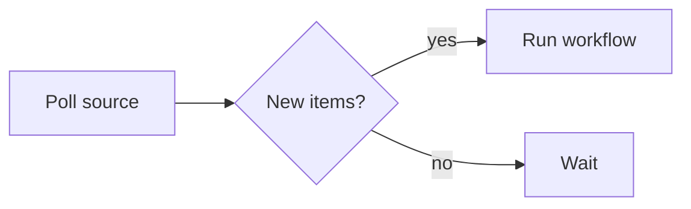

# Workflow reference

Every field of a workflow file, in one place. For the guided version, read
[Writing workflows](/docs/workflows) first.

## The file

A workflow lives at `workflows/*.yaml` and is validated on load.

| Field | Required | Description |
| --- | --- | --- |
| `name` | yes | Display name of the workflow. |
| `description` | no | One-line description shown with the workflow. |
| `group` | no | Label (e.g. `Dev`) that clusters related workflows. |
| `inputs` | no | Parameters collected when the workflow is invoked. See Inputs below. |
| `steps` | yes | The steps, run in order. |
| `articles` | no | Markdown documents produced after the steps. |
| `summarize` | no | Post-run step whose stdout becomes the run's summary. |

## Steps

A step is one of three shapes — `sh:`, `use:`, or `llm:` — plus optional
common fields:

| Field | Description |
| --- | --- |
| `name` | Short label for the step. Falls back to the `use:` ref, the first `sh:` line, or the `llm:` model id. |
| `description` | Longer detail shown with the step. |
| `id` | Handle for `{ step: <id> }` refs. Must match `^[a-z][a-z0-9_-]*$`. |
| `env` | String-to-string map. Values must be strings (`MAX_TURNS: "50"`, not `50`); keys starting `KIRI_` are rejected at load. |
| `outputs` | `sh:`/`use:` steps only. Named values the step promises to emit via `kiri-output`; requires an `id`. See Named outputs below. |

### `sh:` — inline shell

The string runs under `sh -c` with a scoped environment, in a per-run scratch
directory. Start non-trivial scripts with `set -eu`; reach repo files via
`$KIRI_REPO_ROOT`.

```yaml
- sh: |
    set -eu
    cd "$KIRI_REPO_ROOT"
    gh pr list --state open
```

### `use:` — bundle

Runs `bundles/<name>/run.sh`. The step's `env:` map is passed through
verbatim; what each key means is the bundle's contract, documented in its
`README.md`. See Authoring a bundle below.

```yaml
- use: build-site
  env:
    TARGET: production
```

### `llm:` — model completion

Calls a provider directly, in-process; the completion text becomes the step's
stdout. Token counts are recorded on the run.

```yaml
- llm:
    model: anthropic:claude-haiku-4-5   # provider:model — prefix names a kiri.yaml entry
    prompt: |
      Summarise this in three bullets.

      {{DATA}}
  env:
    DATA: { step: fetch }
```

- `model` is `provider:model`. A bare id with no prefix is a load-time error.
  Providers are declared in `kiri.yaml` — see
  [Models & providers](/docs/llm-providers).
- Exactly one of `prompt` / `prompt_file` on every llm entry — steps,
  articles, and summarize alike (`prompt_file` resolves against the
  workspace root).
- Templating is single-pass `{{VAR}}` substitution: the step's `env:` vars —
  including resolved refs — are available by name; unknown vars resolve
  empty.
- No file channels: an `llm:` step gets no `KIRI_RECOMMENDATIONS_FILE` and
  cannot declare `outputs:` — its single product is the completion text on
  stdout.

## Inputs

`inputs:` is a list of `{ name, description?, required?, default?, options? }`.
Declaring any means a run collects values first; a workflow without `inputs:`
invokes immediately.

- `required: true` rejects an empty value.
- `default` pre-fills a value; `options` constrains it to a fixed list.
- Wire a value into any step / article / summarize `env:` with
  `{ input: <name> }`. Refs to undeclared inputs fail at load.
- The resolved map is snapshotted onto the run, so every run records what it
  was invoked with.

## Data flow

- **Every phase gets empty stdin.** Data moves between phases only through
  the env refs each one declares.
- `{ step: <id> }` resolves to that step's stdout, byte-for-byte. Valid on
  later `steps:`, `articles:`, and `summarize:`.
- `{ step: <id>, output: <name> }` resolves to one named value the step
  emitted via `kiri-output` — see Named outputs below. Valid in the same
  places.
- `{ article: <slug> }` resolves to an earlier article's markdown. Valid on
  later `articles:` entries and `summarize:`.
- `{ env: <NAME> }` resolves to a variable in the kiri process environment —
  your workspace `.env` or the shell kiri was launched from. Valid anywhere.
  The way to hand a step a secret without a literal in git-tracked YAML; the
  value is read at spawn and never stored on the run.
- Refs are validated at load: unknown ids or slugs, duplicate ids, refs to
  undeclared output names, self/forward references, and env refs naming a
  variable that isn't set are errors.
- For an `llm:` consumer the resolved value is a prompt template var; for
  `sh:`/`use:` it's an env var — a very large output can hit the OS exec size
  limit, failing the step with an error naming the entry.

## Named outputs

A `sh:`/`use:` step that computes more than one value can declare them and
emit each one by name, instead of making every consumer re-parse its stdout:

```yaml
- sh: |
    set -eu
    kiri-output url "https://example.com/pr/42"
    kiri-output count "3"
  id: fetch
  outputs: [url, count]
```

- `outputs:` names match `^[a-z][a-z0-9_-]*$` and must be unique within the
  step. Declaring any requires an `id` — refs address outputs as
  `{ step: <id>, output: <name> }`.
- `kiri-output <name> <value>` is on the step's `PATH` for the run's
  duration. Called with a name outside the declaration it warns and the value
  is dropped; called in a step with no `outputs:` it exits non-zero — under
  `set -e` that fails the step at the call site.
- The declaration is a contract: a step that exits ok without emitting every
  declared name **fails**, so consumers' refs always resolve. Re-emitting a
  name overwrites it — the last value wins.
- Emitted values are recorded on the run, and count toward a consuming
  step's env size like any other ref.
- Stdout is unaffected — declare outputs and stdout becomes plain logging.

## Step environment

Steps run in a fresh per-run scratch directory (`.kiri/runs/<run-id>/`) with a
scoped env — nothing from the parent shell is inherited; pull a specific
variable in with `{ env: <NAME> }`. User `env:` values apply first; these
overwrite on collision:

| Variable | Set on | Description |
| --- | --- | --- |
| `KIRI_RUN_ID` | every step | The run's ID. |
| `KIRI_STEP_INDEX` | every step | Zero-based index of this step in the run. |
| `KIRI_REPO_ROOT` | every step | Absolute path of the workspace. Steps run in a scratch dir — use this to reach repo files. |
| `KIRI_BUNDLE_DIR` | `use:` steps | Absolute path to the bundle's `bundles/<name>/` directory. |
| `KIRI_RECOMMENDATIONS_FILE` | main `use:`/`sh:` steps | Path the step's recommendations land in — write through `kiri-recommend`. Not set for `llm:` steps. |
| `KIRI_OUTPUTS_FILE` | steps declaring `outputs:` | Path the step's named outputs land in — write through `kiri-output`, which handles the encoding. |
| `PATH`, `HOME`, `USER`, `LOGNAME` | every step | Passed through from the kiri process so tools that authenticate as you keep working. |

## Articles

`articles:` is an array of entries with the same `{ use | sh | llm, env? }`
shape as a step, plus:

| Field | Required | Description |
| --- | --- | --- |
| `slug` | yes | Lowercase letters, digits, hyphens. Unique within the workflow. |
| `name` | no | Series label for the article. Becomes the page title only when the body has no `# Headline`. |

- Entries run serially after `steps:` and before `summarize:`; each entry's
  stdout is the article body.
- Open the body with a single `# Headline` — it's lifted out as the page
  title, and anything before it is dropped. `##` headings become the page's
  table of contents.
- Markdown renders through a sandboxed parser — no raw-HTML pass-through.
- Articles are linked from the run and the feed.

### Charts

Fence a block as ` ```chart ` with an inline
[Vega-Lite](https://vega.github.io/vega-lite/) spec — bar, line, area,
scatter, pie, heatmap, and more, themed to match the surface:

```chart
{
  "width": "container",
  "height": 200,
  "data": {
    "values": [
      { "day": "Mon", "runs": 12 },
      { "day": "Tue", "runs": 19 },
      { "day": "Wed", "runs": 8 },
      { "day": "Thu", "runs": 15 },
      { "day": "Fri", "runs": 23 }
    ]
  },
  "mark": "bar",
  "encoding": {
    "x": { "field": "day", "type": "nominal" },
    "y": { "field": "runs", "type": "quantitative" }
  }
}
```

Data must be inline in `data.values` — a spec that fetches a remote URL is
rejected. An invalid spec degrades to an inline notice without breaking the
article.

### Diagrams

Fence a block as ` ```mermaid ` with [Mermaid](https://mermaid.js.org/)
syntax. The reader gets the diagram, with the source on demand; bad input
degrades to a notice. Reach for a chart when the point is the numbers, a
diagram when the point is how things connect.



## Summaries

`summarize:` has the same `{ use | sh | llm, env? }` shape as a step and runs
after `steps:` and `articles:`. Its stdout becomes the run's one-or-two-line
summary in the feed.

- Like every phase, it declares its data with env refs — typically the
  finished article (`{ article: <slug> }`), a named output
  (`{ step, output }`), or a step's stdout (`{ step: <id> }`). Keep the ref
  narrow: pass what the summary is about, not every upstream blob.
- An `llm:` summariser declares its prompt like any other llm entry; a
  `sh:` summariser over a named output is often enough and costs nothing.
- A failing summariser never fails the run; the summary just stays empty.

## Recommendations

A main `use:`/`sh:` step can propose follow-up invocations, surfaced as
one-click recommendations on the run. Emit each with `kiri-recommend` — on
the step's `PATH` for the run's duration:

```sh
kiri-recommend --workflow "PR Review" --title "Review owner/repo #42" \
  --description "fix: quote args (by @lee)" \
  --input pr_number=42 --input repo=owner/repo
```

| Flag | Required | Description |
| --- | --- | --- |
| `--title` | yes | Title of the recommendation. |
| `--workflow` | yes | Name of the workflow to invoke. |
| `--description` | no | Supporting line under the title. |
| `--input <key>=<value>` | no, repeatable | Pre-filled into the invocation; keys should match the target's declared inputs. |

A malformed call exits non-zero without writing — under `set -e` the step
fails at the offending line. A failed or cancelled step's recommendations
are discarded.

## Authoring a bundle

A bundle is a folder `bundles/<name>/` containing an executable `run.sh` (plain
POSIX shell) and a `README.md` documenting its env-var contract:

```sh
#!/bin/sh
set -eu

# Required from kiri
: "${KIRI_REPO_ROOT:?required (kiri injects this)}"

# Required from the workflow's env: block — wire data in with env refs
: "${TARGET:?TARGET env var is required}"

# Do the thing; stdout is the step's output, addressable via { step: <id> }
printf 'processed %s\n' "$TARGET"
```

Exit `0` on success, non-zero on failure. Resolve file reads against
`$KIRI_REPO_ROOT`, not the cwd. To fork an existing bundle:
`cp -r bundles/claude-code bundles/my-bundle`.

## Execution semantics

- Runs are **independent** — invoking several workflows (or the same one
  twice) runs them concurrently; there is no global queue.
- Runs are **fail-fast**: a failing step marks the run `failed` and skips
  everything after it, including `articles:` and `summarize:`. A failing
  article entry halts the remaining entries and the summariser. Only a failing
  summariser is non-fatal.
- Cancelling a run sends `SIGTERM` then `SIGKILL`; a run cancelled
  mid-`steps:` skips the rest.
- There is no cron, file watch, or webhook. For polling shapes, write a
  workflow whose first step does the poll and run it when you want it.
