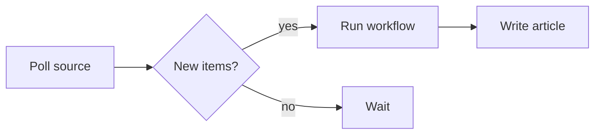

# Workflows

A workflow is a YAML file in `workflows/*.yaml` describing a pipeline kiri runs
on demand. This page covers the full anatomy: step types, inputs, piping,
summaries, articles, and recommendations.

## Anatomy of a workflow

Every workflow has a `name` and a list of `steps`. Two optional top-level fields
shape how it presents:

- **`description`** — a one-line summary rendered as the deck beneath the title.
- **`group`** — a label (e.g. `Dev`) shown as the page eyebrow, so related
  workflows read as a set.

```yaml
name: Patch
description: Patches Dependabot alerts and opens a PR.
group: Dev
steps:
  - sh: echo "patching"
```

A workflow can also declare `inputs:`, and after its steps it can produce
`articles:` and `summarize:` itself — all covered below.

## Step types

A step is one of three shapes. Pick by what the step needs to *do*.

### Inline shell — `sh:`

The simplest step. The string runs under `sh -c` with a scoped environment.
Good for quick commands that don't warrant a bundle:

```yaml
name: open-prs
steps:
  - sh: |
      cd "$KIRI_REPO_ROOT"
      gh pr list --state open
```

Start every non-trivial `sh:` step with `set -eu` — `sh -c` doesn't stop on the
first failure by default.

### Bundle — `use:`

A bundle is a folder `bundles/<name>/` in your repo containing an executable
`run.sh`. A `use:` step runs that script. Bundles are reusable and
version-controlled, and each defines its own `env:` contract — the keys it
expects (keys starting with `KIRI_` are reserved):

```yaml
name: build
steps:
  - use: build-site
    env:
      TARGET: production
```

Kiri passes the `env:` map through verbatim; what each key means is up to the
bundle, documented in its own `README.md`. The
[Examples](/docs/examples) ship ready-made bundles — including a Claude Code
runner — to copy into `bundles/` and adapt. See *Authoring a bundle* below to
write your own.

### Model completion — `llm:`

For a plain model completion — send a prompt, get text back — an `llm:` step
calls a provider directly, in-process, with no bundle to write. The model's text
response becomes the step's stdout. `model` is a `provider:model` id whose prefix
names an entry in `kiri.yaml`; supply exactly one of `prompt` (inline) or
`prompt_file`. `{{KIRI_INPUT}}` carries the previous step's stdout:

```yaml
name: summarise
steps:
  - sh: cat notes.md
  - llm:
      model: anthropic:claude-haiku-4-5
      prompt: |
        Summarise this in three bullets.

        {{KIRI_INPUT}}
```

Reach for a bundle when a step needs to *do* something agentic — open files, run
tools, shell out; reach for `llm:` when it just needs a completion. `articles:`
and `summarize:` accept `llm:` too. See [LLM providers](/docs/llm-providers) for
the provider registry and the full `llm:` contract.

### Labelling a step — `name:` / `description:`

Both optional, both work on any step shape. `name:` is a short label shown as the
step's title in the Schema tab and the run timeline; without it a step falls back
to its `use:` reference, the first line of its `sh:` script, or its `llm:` model
id. `description:` is longer detail revealed when the step's row is expanded.

```yaml
steps:
  - sh: |
      set -eu
      ./deploy.sh
    name: Deploy the site
    description: Builds and ships the production bundle.
```

## Inputs

An optional list of **named parameters collected via a modal** when you click
**Run**. One definition can target many things — a single `pr-review` workflow
with a `pr_number` input reviews any PR, instead of one YAML file per PR.
Workflows with no `inputs:` invoke on a single click.

```yaml
name: pr-review
inputs:
  - name: pr_number
    description: GitHub PR to review
    required: true
  - name: branch
    default: main
steps:
  - sh: echo "pr=$PR_NUMBER branch=$BRANCH"
    env:
      PR_NUMBER:
        input: pr_number
      BRANCH:
        input: branch
```

Each input is `{ name, description?, required?, default?, options? }`.
`required: true` gates the modal's submit until the field is non-empty;
`default` pre-fills it; `options` constrains it to a picker. Wire an input into
any step / articles / summarise `env:` with `{ input: <name> }` — refs to
undeclared inputs fail at load. The resolved input map is snapshotted onto the
run, so the feed and run page reflect what the run was invoked with.

## Piping output between steps

Each step's stdout is piped into the next step's stdin. The first step receives
empty stdin. A step reads it however it likes — an `sh:` step with `cat`, or
whatever a bundle's `run.sh` does:

```yaml
name: greet
steps:
  - sh: echo "Lee"
  - sh: |
      name=$(cat)
      echo "hello, $name"
```

`articles:` entries and `summarize:` receive **empty** stdin — they take what
they need through env refs (below). Runs are fail-fast: a non-zero exit on any
`steps:` entry fails the run and skips everything after it, including
`articles:` and `summarize:`; a failing article entry likewise halts the rest.

## Referencing step outputs

Stdin only carries the *previous* step's stdout. To reach any earlier output —
or to feed an `articles:` entry or `summarize:` — give the producing step an
`id:` and reference it from a consumer's `env:` with a structured ref:

```yaml
name: release-notes
steps:
  - sh: git log --oneline v1..HEAD
    id: changes
  - sh: echo "unrelated middle step"
  - llm:
      model: anthropic:claude-haiku-4-5
      prompt: |
        Rewrite these commits as release notes.

        {{CHANGES}}
    env:
      CHANGES:
        step: changes        # ← the `changes` step's stdout, byte-for-byte
articles:
  - slug: notes
    sh: 'printf "%s" "$CHANGES"'
    env:
      CHANGES:
        step: changes
```

- `{ step: <id> }` resolves to that step's stdout exactly as written — never
  trimmed or truncated. Valid on later `steps:`, `articles:`, and `summarize:`.
- `{ article: <slug> }` resolves to an earlier article's markdown. Valid on
  later `articles:` entries and `summarize:`.
- Refs are validated when the workflow loads: unknown ids or slugs, duplicate
  ids, and self/forward references are errors. Ids match `^[a-z][a-z0-9_-]*$`.
- For an `llm:` step the resolved value is a prompt template var like any
  other env entry; for `sh:`/`use:` steps it's an env var, so a very large
  output can hit the OS exec size limit — the step fails with an error naming
  the offending entry.

## Step environment

Every step runs in a fresh per-run scratch directory (`.kiri/runs/<run-id>/`)
with a scoped env — nothing from the parent shell is inherited. User `env:`
values apply first; the variables below overwrite on collision, so a workflow
can't redirect `PATH` or shadow kiri's identity vars.

| Variable | Set on | Description |
| --- | --- | --- |
| `KIRI_RUN_ID` | every step | The run's ID. |
| `KIRI_STEP_INDEX` | every step | Zero-based index of this step in the run. |
| `KIRI_REPO_ROOT` | every step | Absolute path of the workspace. Steps run in a scratch dir — use this to reach repo files (`cd "$KIRI_REPO_ROOT"`). |
| `KIRI_BUNDLE_DIR` | `use:` steps | Absolute path to the bundle's `bundles/<name>/` directory. |
| `KIRI_SUMMARY_CONTEXT` | `summarize:` only | A prompt-ready plain-text digest of the run — workflow name and duration, a section per step with its stdout, then the articles the run produced (each stream capped at 64 KB). An `llm:` summariser templates it as `{{KIRI_SUMMARY_CONTEXT}}`. |
| `KIRI_RECOMMENDATIONS_FILE` | main `use:`/`sh:` steps | Path the step may write JSON Lines to — one proposed follow-up per line. Not set for `llm:` steps. |
| `PATH`, `HOME`, `USER`, `LOGNAME` | every step | Passed through from the kiri process so tools that authenticate as you keep working. |

Keys starting with `KIRI_` in your `env:` map are rejected at load time — the
prefix is reserved. Values must be strings (`MAX_TURNS: "50"`, not `50`).

## Summaries

An optional post-run step whose stdout becomes the run's one-or-two-sentence
summary, shown on the feed row and at the top of the run page. It has the same
`{ use | sh | llm, env? }` shape as a step and runs after `steps:` and
`articles:`. A failing summariser does not change the run's status.

```yaml
name: hello
steps:
  - sh: echo "hello world"
summarize:
  sh: echo "said hello to the world"
```

Every `summarize:` step receives the run digest as `KIRI_SUMMARY_CONTEXT` —
a bundle/`sh:` step reads the env var, an `llm:` step templates
`{{KIRI_SUMMARY_CONTEXT}}` — and it can pull specific outputs at full fidelity
with `{ step: <id> }` / `{ article: <slug> }` env refs. For an AI-written
summary, a `summarize: { llm: { model } }` with no prompt is **zero-config** —
kiri supplies a built-in summary prompt over the digest.

## Articles

An optional array of long-form markdown articles produced by the run, declared
under `articles:`. Each entry has the same `{ use | sh | llm, env? }` shape,
plus a `slug` (lowercase letters, digits, hyphens — unique within the workflow)
and an optional display `name`. Entries run serially after `steps:` and before
`summarize:`; each entry's stdout is captured as the article body. They receive
empty stdin and no auto-injected data — wire in exactly what the article needs
with `{ step: <id> }` env refs (an earlier step's stdout, by that step's `id:`)
or `{ article: <slug> }` refs (an earlier entry's article).

```yaml
name: status
steps:
  - sh: echo "all systems go"
articles:
  - slug: report
    name: Daily Status
    sh: |
      echo "# Daily Status"
      echo
      echo "All systems reporting healthy."
```

Articles surface as chips on the activity feed row, as links in the run's body,
and under an **Articles** phase on the run page. Each opens a dedicated page
that renders the markdown through a sandboxed parser — no raw-HTML
pass-through.

### Charts

Article markdown can embed charts. Fence a block as `chart` with an inline
[Vega-Lite](https://vega.github.io/vega-lite/) spec and kiri renders it inline —
bar, line, area, scatter, pie, heatmap, and more, themed automatically to match
the surface:

```chart
{
  "width": "container",
  "height": 200,
  "data": {
    "values": [
      { "day": "Mon", "runs": 12 },
      { "day": "Tue", "runs": 19 },
      { "day": "Wed", "runs": 8 },
      { "day": "Thu", "runs": 15 },
      { "day": "Fri", "runs": 23 }
    ]
  },
  "mark": "bar",
  "encoding": {
    "x": { "field": "day", "type": "nominal" },
    "y": { "field": "runs", "type": "quantitative" }
  }
}
```

The data must be inline in `data.values`; a spec that fetches a remote URL is
rejected, and an invalid spec degrades to an inline notice without breaking the
article.

### Diagrams

For structure rather than numbers, fence a block as `mermaid` with
[Mermaid](https://mermaid.js.org/) syntax. The reader gets the diagram first,
with the source on demand:



Reach for a chart when the point is the numbers, a diagram when the point is how
things connect. Both degrade to a notice on bad input rather than crashing.

## Recommendations

A main step can propose follow-up workflow invocations attached to the run that
produced them. A run that aggregates open PRs, for example, can recommend one
`pr-review` invocation per PR with `pr_number` pre-filled — turning the
aggregator into a launch pad for one-click follow-ups, shown under a
**Recommended** section on the run page.

To emit recommendations, write JSON Lines to `$KIRI_RECOMMENDATIONS_FILE` — one
object per line:

```yaml
name: open-prs
steps:
  - sh: |
      gh pr list --json number,title --jq '.[]' | while read -r pr; do
        number=$(echo "$pr" | jq -r .number)
        title=$(echo "$pr" | jq -r .title)
        jq -n --arg n "$number" --arg t "$title" \
          '{title: ("Review PR #" + $n + ": " + $t), workflow: "pr-review", inputs: {pr_number: $n}}' \
          >> "$KIRI_RECOMMENDATIONS_FILE"
      done
```

Each line has `title` (required), `workflow` (required — the workflow name to
invoke), `description` (optional), and `inputs` (optional `{ string: string }`
map pre-filled into the invoke modal). Malformed or schema-failing lines are
skipped with a warning; the rest still ingest. The file is set on main
`use:`/`sh:` steps only — not on `articles:`, `summarize:`, or `llm:` steps — and
a failed or cancelled step's file is discarded.

## Authoring a bundle

Add a folder under `bundles/<name>/` with `run.sh` plus a `README.md` documenting
its env-var contract. `run.sh` is plain POSIX shell, must be executable, reads the
previous step's stdout on stdin, and writes its result on stdout:

```sh
#!/bin/sh
set -eu

# Required from kiri
: "${KIRI_REPO_ROOT:?required (kiri injects this)}"
: "${KIRI_RUN_ID:?required (kiri injects this)}"

# Required from the workflow's env: block
: "${TARGET:?TARGET env var is required}"

# Read previous step's output (empty for first step)
input="$(cat)"

# Do the thing; stdout goes to the next step / article / summary
printf 'processed %s for %s\n' "$TARGET" "$input"
```

Exit `0` on success, non-zero on failure — the exit code is what kiri reads.
Resolve anything you read from disk against `$KIRI_REPO_ROOT`, not relative cwd.
To fork an existing bundle: `cp -r bundles/claude-code bundles/my-bundle`.

## Execution semantics

- Runs are **independent** — invoking several workflows (or the same one
  twice) runs them concurrently; there is no global queue.
- Runs are **fail-fast**: a failing step in `steps:` marks the run `failed`
  and skips everything after it, including `articles:` and `summarize:`. A
  failing article entry halts the remaining entries and the summariser and
  fails the run. Only a failing summariser is non-fatal — the run's work
  already completed, so its status stands and the summary stays empty.
- **Cancel** from the UI sends `SIGTERM` then `SIGKILL`; a run cancelled
  mid-`steps:` skips the rest, including articles and the summariser.
- There is no cron, file watch, or webhook. For polling shapes, write a workflow
  whose first step does the poll and run it when you want it.
